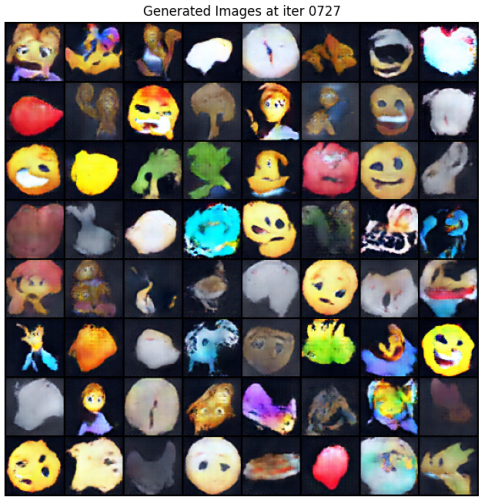

# GANEMOJI

這是一個使用 Deep Convolutional GAN (DCGAN) 生成 Emoji 的專案，並包含一個 PyQt5 圖形介面 (GUI) 進行展示與操作。

## 範例圖片

## 功能

1.  **Show Training Images**: 展示用於訓練的 Emoji 圖片以及增強圖片範例。
2.  **Show Model Structure**: 顯示 Generator 與 Discriminator 的模型架構。
3.  **Show Training Loss**: 顯示訓練過程中的 Loss 變化圖。
4.  **Inference**: 使用訓練好的模型生成新的 Emoji 圖片，並展示訓練過程的動畫。

## 環境

- Python 3.x
- PyTorch
- PyQt5
- Pillow (PIL)
- Matplotlib
- torchvision

## 檔案結構

- `q2_demo.py`: 主程式入口，包含 GUI 邏輯。
- `preprocess_data.py`: 圖片前處理工具，將含透明背景的圖片轉為黑色背景，以便於 GAN 訓練。
- `module/`: 包含模型定義與輔助功能的模組。
  - `gan.py`: 定義 Generator 與 Discriminator 類別。
  - `emoji.py`: 處理資料載入與訓練邏輯。
- `Newemoji/`: 訓練資料集目錄。
- `train/ganimg/`: 存放生成過程的圖片。
- `netG.pt`, `netD.pt`: 預先訓練好的生成器與判別器模型權重。

## 注意事項

- 如果要重新訓練，請確保 `Newemoji` 資料夾內有正確的圖片資料。
- 生成的圖片會儲存在 `train/ganimg/` 中。

